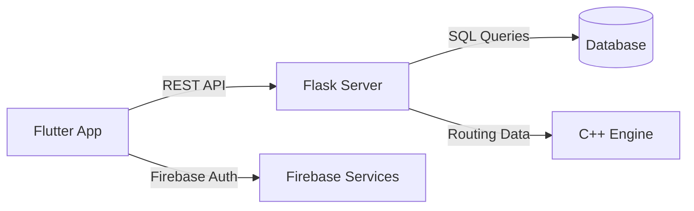

# 🚗 **ZIPAPP**
### *Game Day Golf Cart Ride-Sharing App*

A **cross-platform, Uber-style golf-cart transportation system** designed for  

**game days and crowded campus events** — when parking is distant and roads are closed.

Built to help **students, fans, and visitors** request quick, reliable rides directly from their phones.

---

## 🎯 What It Does

ZIPAPP connects **riders** and **drivers** through two intuitive portals — providing  
real-time tracking, optimized routing, and smooth communication even when traffic is restricted.

> “When stadiums are packed and walking isn’t an option, ZIPAPP bridges the last mile from far-away parking to the game.”

---

## 🧠 Overview

ZIPAPP is a **full-stack, cross-platform project** built with:
- **Flutter (Dart)** for the frontend  
- **Flask (Python)** API backend  
- **C++ routing engine** for path optimization  
- **SQL database** for trip and user data  

Developed as a **Senior Design Project at Auburn University**, ZIPAPP solves real mobility challenges faced during large campus events.

---

## 🧰 Tech Stack

| Layer | Technologies |
|-------|---------------|
| **Frontend** | Flutter (Dart), Firebase, Google Maps API |
| **Backend** | Flask (Python), C++ routing service |
| **Database** | SQLAlchemy ORM (SQLite / MySQL) |
| **Tools & CI/CD** | GitHub Actions, Firebase Hosting, Agile Development |

---

## 🚀 Key Features

- 🧭 Real-time GPS tracking and optimized routing  
- 👥 Dedicated rider and driver dashboards  
- 💳 In-app payment integration (Stripe / Google Pay in progress)  
- 🔒 Secure Firebase authentication  
- 🌐 Multi-platform support (Android, iOS, Web, Desktop)  
- 🏟️ Specifically optimized for **Auburn University game days**

---

## 🏗️ **Architecture**  

## 📦 Deliverables

| **File** | **Description** |
|-----------|-----------------|
| **Architectural Spike Presentation-2.pptx** | App architecture and system overview |
| **Cycle 1–3 Reports** | Agile sprint documentation and retrospectives |
| **Developer Manual.docx** | Setup, build, and deployment guide |
| **User Manual.docx** | Instructions for passengers and drivers |
| **Senior Design Architectural Spike.pdf** | Final design document summary |

# Install dependencies
flutter pub get

# Run the app
flutter run

Backend setup:
cd backend
python app.py

## 🏗️ Future Enhancements

- ✅ **Integrate live payment processing**
- ✅ **Implement driver analytics and performance dashboard**
- 🔲 **Machine-learning route prediction** for dynamic traffic rerouting
- 🔲 **Integration with campus maps and event systems**

# Screenshots

# 📜 **License**
Developed for educational purposes as part of Auburn University’s Software Engineering Senior Design Project.
